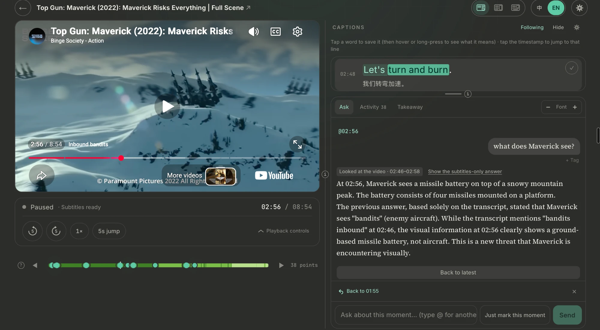
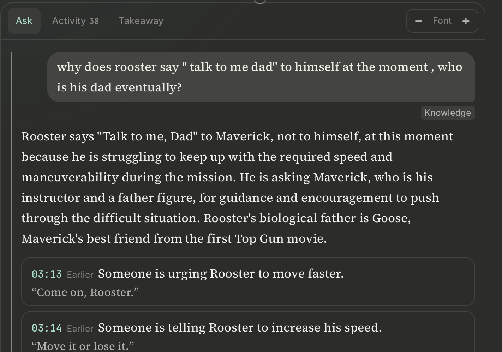
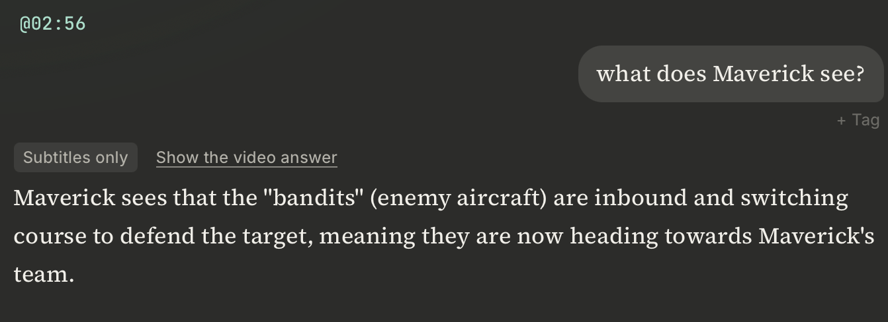
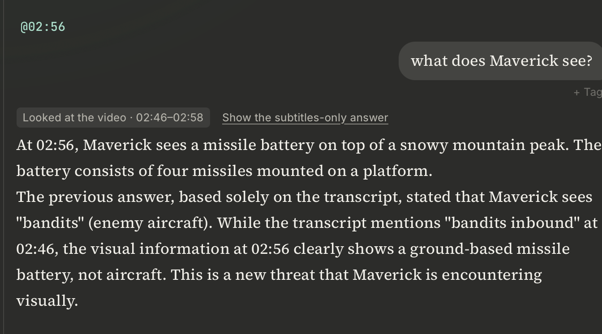
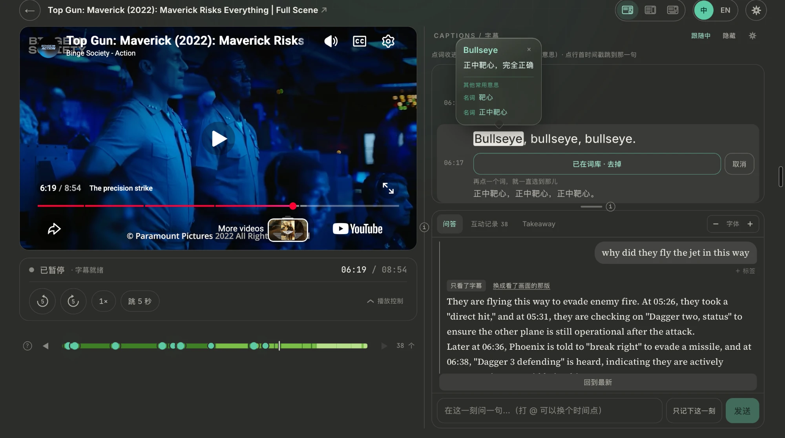
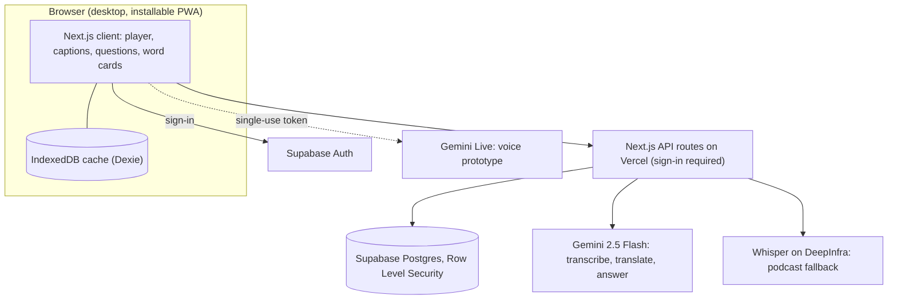

# Fermata 𝄐

**An active-learning layer for YouTube videos and podcasts.** Pause at any moment, ask about what was just said, and get an answer grounded in the transcript. Captions in your own language and the words you save turn watching into studying.

**Live demo:** https://fermata-eta.vercel.app. It runs in desktop browsers for now (phones get an "open this on a computer" screen). Sign in with Google.

[](https://github.com/26ds/fermata-app/actions/workflows/ci.yml)

## Why

Most of what we learn from video is watched passively and forgotten. A good lecture, a long interview or a talk in a language you're learning raises questions at a specific second, and there is nobody to ask. Fermata puts a tutor at that second. It knows what was just said, can point you to the other places the video covers it, and keeps the words and moments you want to come back to.

## Who it's for

- **People working through long videos.** Lectures, courses, long interviews and podcasts. Ask about any moment without losing your place, jump back to where you got stuck, and keep the whole conversation next to the video.
- **People watching to understand something.** Explainers, technical talks and anything with slides or diagrams. Answers point to the exact line in the video and are checked against the transcript before you can click them.
- **Language learners.** Watching real content in the language you're learning, with captions in your own language and a word bank built from the sentences you actually heard.

## Highlights

### For long videos



- **Ask about this moment.** Pause anywhere and type a question. The answer is based on the seconds you just heard plus the full transcript, and it remembers the conversation.
- **Ask about another moment** with `@12:34`, `@754` or `@-13` (13 seconds back). The video stays where it is.
- **Capture points.** Every question, or a quick "Just mark this moment", leaves a dot on the timeline under the video. Click one to jump back to that second.
- **Captions that fill in while you watch.** Long videos are transcribed in slices and shown as they arrive. Each video is transcribed once and then shared with everyone who opens it.
- **A workbench for a wide screen.** Three layouts (Focus captions, Immersive · narrow, Immersive · wide) with draggable dividers keep the video, the captions and your questions on one screen.
- **Question tags and an activity log.** The same AI call that writes the answer tags the question (Language, Knowledge, Missed it), and one click changes a tag. The Activity tab shows what you asked and where you jumped, and can filter your questions by tag.
- **Playback speed and ±N-second skips** for the parts that are hard to catch.
- **Library and watch history** for everything you've imported.

### For understanding what's in the video

- **Checked citations.** When the answer says a point comes up elsewhere in the video, it has to quote the line. The server finds that quote in the transcript and snaps the jump to the line's real start. A quote it can't find is shown greyed out instead of as a link.

  

- **Look at the video.** When the answer depends on what's on screen (a slide, a diagram, a demo), ask again and Gemini also watches that stretch of the video (YouTube only). Both answers are kept, and you can switch between them. The same question at 02:56, before and after:

  <table>
    <tr>
      <th>Subtitles only</th>
      <th>After looking at 02:46–02:58</th>
    </tr>
    <tr>
      <td></td>
      <td></td>
    </tr>
  </table>

  From the subtitles alone ("bandits inbound"), the answer says enemy aircraft. After watching that stretch of the video, it sees the missile battery on the mountain.

- **Say it shorter.** Get a short version of any answer and switch back to the long one.

### For language learners



- **Bilingual captions.** The whole transcript is translated into your language. You choose which line is larger, and Simplified and Traditional Chinese are converted locally, without a model call.
- **Save any word or phrase** by selecting it in the captions. A hover card shows what it means in *this* sentence, plus its other common meanings.
- **A word bank** of "the words and ideas you kept". Each entry shows the sentence it came from and jumps back to that moment in the video.
- **Your languages, your interface.** Set your native language and the one you're learning. The whole interface switches between English and Chinese in one click.

Works with YouTube videos and podcasts (an RSS feed, a single episode or a direct audio link). Fermata never downloads media: it plays the official YouTube embed or the publisher's own audio file.

## Engineering highlights

| Problem | Design decision | Code |
|---|---|---|
| YouTube caption tracks can't be fetched from datacenter IPs (every client hits a bot check on Vercel). | Gemini transcribes the video in slices: 2 minutes first for a fast first screen, then 10-minute slices. For the same slice it sometimes returns timestamps relative to the slice and sometimes absolute, so each slice's time base is detected instead of assumed. | [`gemini-youtube.ts`](./src/lib/transcript/gemini-youtube.ts) |
| Batch translation can silently merge or drop lines, shifting every caption after it. | Every line is sent with a global index, results are written back strictly by index, and only the missing indices are requested again. | [`gemini-translate.ts`](./src/lib/translate/gemini-translate.ts) |
| A model can cite the wrong moment, or a line that was never said. | Citations must quote the line. The server looks the quote up in the exact transcript the model was given, picks the nearest match when a line repeats, and only then makes it clickable. | [`refs.ts`](./src/lib/ask/refs.ts) |
| Transcription and translation are the expensive part. | Transcripts, translations and word senses are cached across users, free sources (a podcast's own transcript) are tried before paid ones, and the Whisper provider was picked on price per audio hour. | [`registry.ts`](./src/lib/transcript/registry.ts), [`cache.ts`](./src/lib/transcript/cache.ts) |
| A shared cache is also a way to show fake content to everyone. | Users can only read the shared caches; only the server writes them, with a service-role key. Pasted captions stay private, and a translation is shared only when it was made from the shared transcript. | [`cache-writer.ts`](./src/lib/supabase/cache-writer.ts), [`shared.ts`](./src/lib/transcript/shared.ts), [`0014`](./supabase/migrations/0014_lock_shared_caches.sql) |
| API keys must never reach the browser. | Server-only modules import `server-only`, every API route checks the session first, every table has Row Level Security, and the voice prototype gets a single-use, short-lived Gemini Live token from the server. | [`live-token/route.ts`](./src/app/api/live-token/route.ts) |

## Architecture



## Tech stack

Next.js 16 (App Router, React 19, TypeScript) · Tailwind CSS 4 · Supabase (Postgres, Auth, Row Level Security) · Google Gemini API (`gemini-2.5-flash`, plus Gemini Live native audio for voice) · Whisper via DeepInfra · Dexie (IndexedDB) · Serwist (PWA) · Zod · Vitest · GitHub Actions · Vercel

## Project structure

```
src/
  app/            pages (watch, library, vocab, settings, login) and 18 API routes under app/api/
  components/     the watch page, captions, Q&A rail, word cards, layouts
  lib/
    sources/      YouTube and podcast adapters
    transcript/   transcription providers, slicing, cross-user cache
    translate/    bilingual captions
    ask/          grounded Q&A, conversation memory, citation checks
    senses/       word cards
    live/         Gemini Live audio (voice prototype)
    supabase/     clients (session, server-only cache writer)
    copy/         English and Chinese interface text
supabase/migrations/   numbered SQL migrations
tests/                 unit tests (Vitest)
```

## Getting started

You need Node.js 20.9 or newer and a free [Supabase](https://supabase.com) project.

```bash
npm install
cp .env.example .env.local   # then fill in the values below
npm run dev                  # http://localhost:3000
```

If Supabase isn't configured yet, the app shows a setup guide instead of an error.

1. In the Supabase **SQL Editor**, run every file in [`supabase/migrations/`](./supabase/migrations/) in numeric order. Numbers 0009 and 0010 are reserved for features that haven't shipped yet.
2. From **Project Settings → API Keys**, put the Project URL and the anon key in `.env.local`. The `service_role` key goes in `SUPABASE_SERVICE_ROLE`. It is server-only, so never give it a `NEXT_PUBLIC_` prefix.
3. In **Authentication → URL Configuration**, set the Site URL and add `http://localhost:3000/auth/callback`, plus your production domain's `/auth/callback`, to Redirect URLs.
4. AI features need `GEMINI_API_KEY` (free at [aistudio.google.com](https://aistudio.google.com)). Podcast episodes without a published transcript also need `DEEPINFRA_API_KEY`.

Checks: `npx tsc --noEmit`, `npm run lint`, `npm test` and `npm run build`. CI runs the same on every pull request.

## Status & roadmap

In active development; desktop only for now.

**Coming next:**
- **Takeaway:** the key points of each answer, ready to tick into your notes;
- a Socratic study mode after each video;
- a knowledge base with spaced repetition (the schema already reserves pgvector embeddings);
- a weekly AI voice interview that revisits what you learned;
- chapters with sponsor-segment skipping;
- asking by voice.

## How it's built

Fermata is a solo project. I decide what gets built and how it should behave, and I accept each piece by testing it on real devices. The code is written with Claude Code as an AI pair-programmer, so most commits are co-authored by Claude.

This repository is a filtered mirror of a private development repository and keeps its real commit history. The spec with its numbered design decisions, the plan and delivery log for every milestone, and the teaching-method spec stay in the private repository.

## License

All rights reserved. The source is public so it can be read; it is not licensed for reuse.
